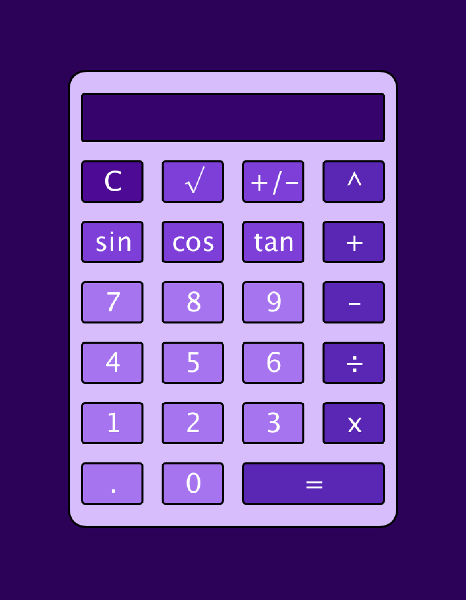
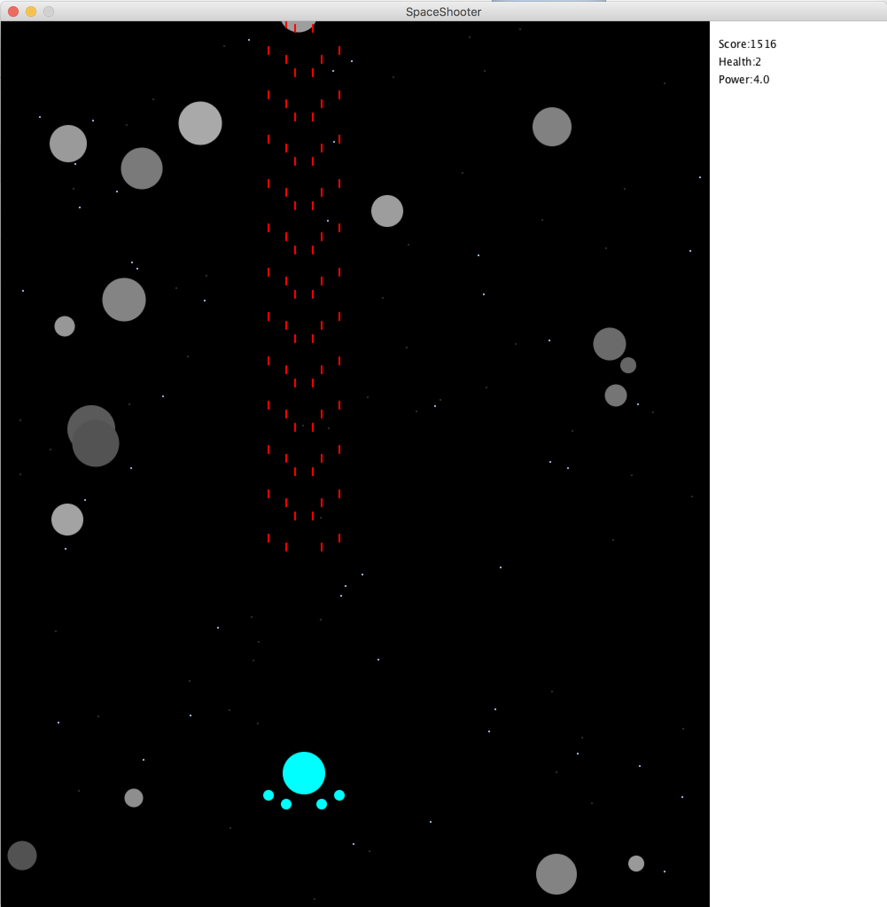
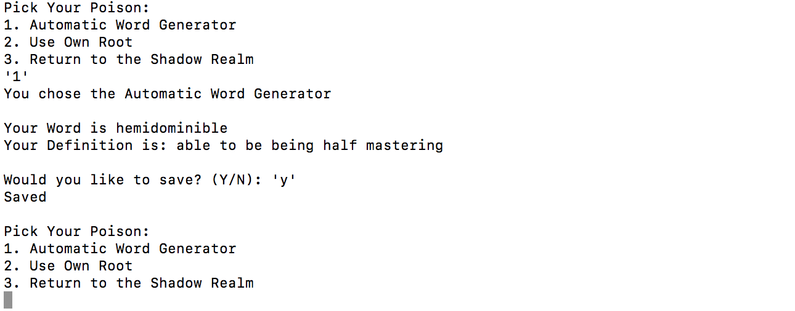
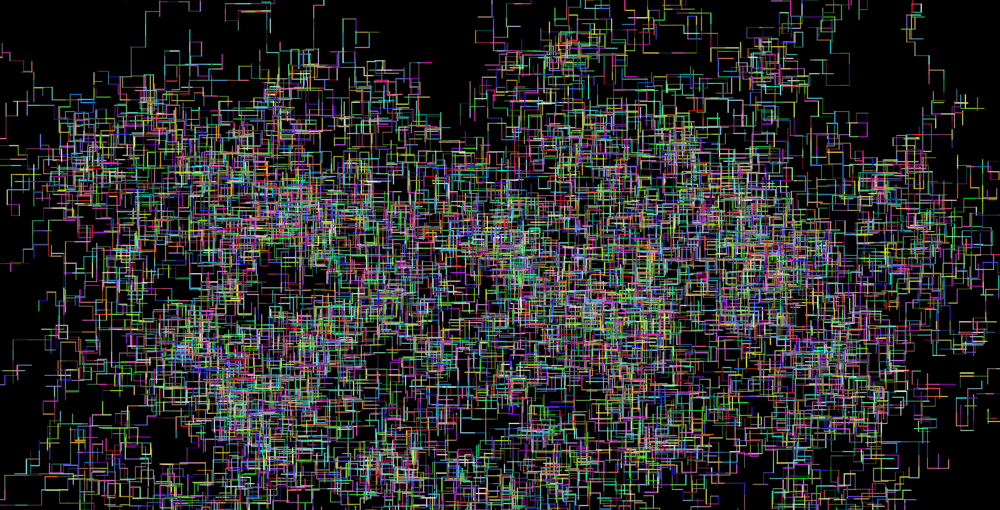

# Welcome to Anthony Liu's Programming Portfolio
### 2018-2019 Programming 1 | duoduoliu8028@gmail.com
#### Certifications: Python,Java

## Object Oriented Calculator
- Coded in Processing
- Fully Fuctional(Basic Operators, Exponents, Sqaure Roots, Trigonometry)
- Purple Themed Calculator

[Source Code](https://github.com/pwnkickfly/2019Programing1Portfolio/blob/master/Calc/Calculator.zip)

## Space Shooter Game
- Coded in Processing
- Movement by Arrow Keys, Spacebar to Fire
- Progressive Power Ups
- Shoot The Rocks to Get Points

[Source Code](https://github.com/pwnkickfly/2019Programing1Portfolio/blob/master/SpaceShooter/SpaceShooter.zip)

## Word Generator
Description

[Source Code](https://github.com/pwnkickfly/2019Programing1Portfolio/blob/master/WordGen/wordGen.zip)

## Screensaver
Description

[Source Code](https://github.com/pwnkickfly/2019Programing1Portfolio/blob/master/Screensaver/ScreenSaver.zip)

